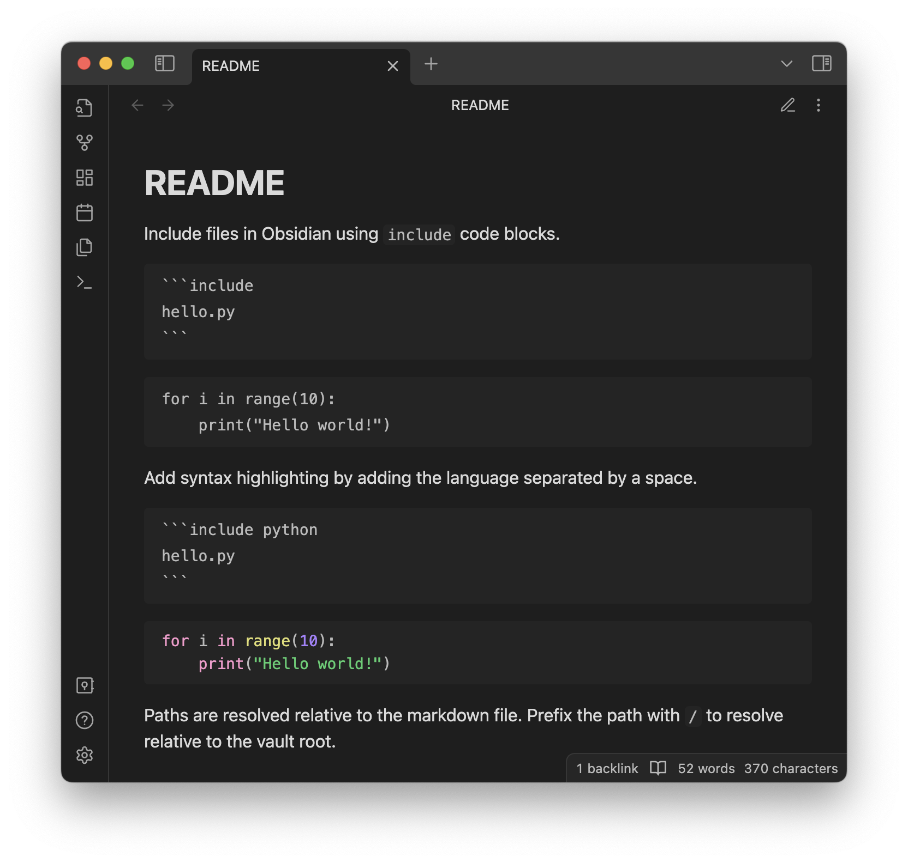

Include files in Obsidian using `include` code blocks.

~~~
```include
hello.py
```
~~~

```include
hello.py
```

Add syntax highlighting by adding the language separated by a space.

~~~
```include python
hello.py
```
~~~

```include python
hello.py
```

Paths are resolved relative to the markdown file. Prefix the path with `@/` to resolve relative to the vault root.
